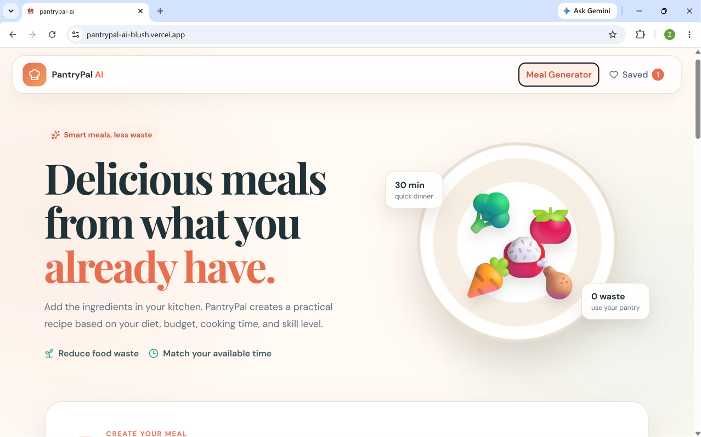
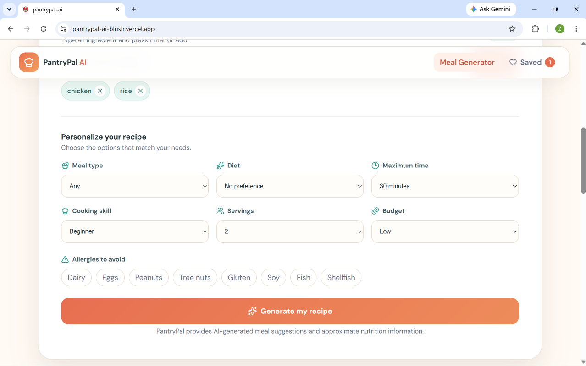
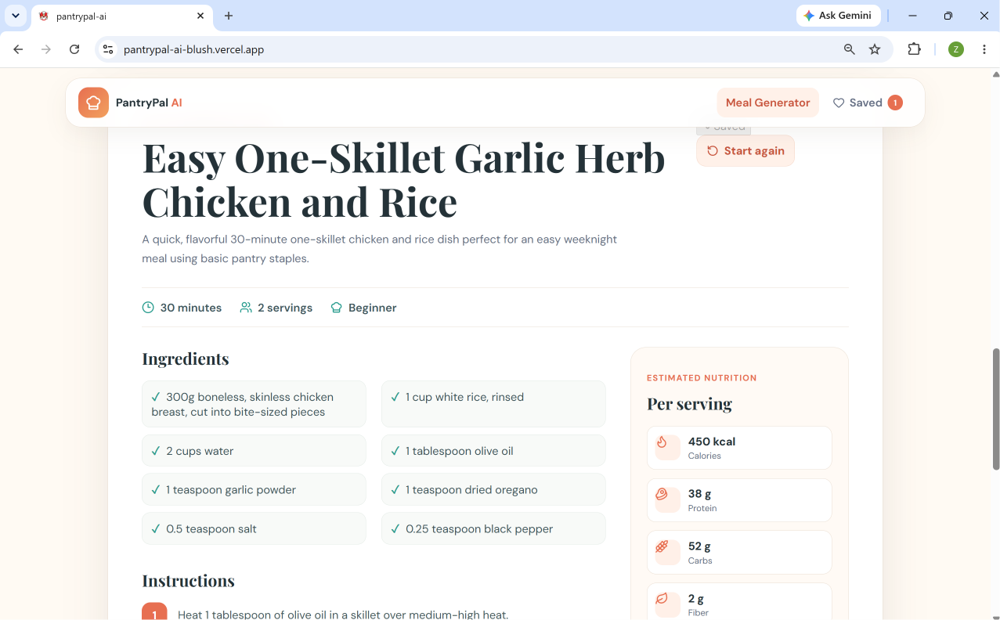
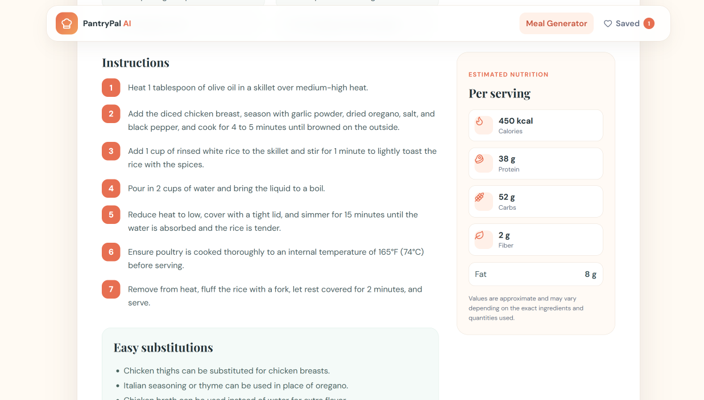

# 🥗 PantryPal AI

PantryPal AI is an intelligent meal planning application that helps users create practical recipes using the ingredients they already have at home. Instead of searching through countless recipes online or buying additional ingredients, users can simply enter what is available in their kitchen and receive a personalized recipe generated by artificial intelligence.

The application is designed for students, busy professionals, families, and anyone who wants to reduce food waste while preparing quick and delicious meals.

--- 

## Table of Contents

- [Live Application](#-live-application)
- [Problem Statement](#-problem-statement)
- [Target Users](#-target-users)
- [Features](#-features)
- [AI Feature](#-ai-feature)
- [Technologies Used](#-technologies-used)
- [Screenshots](#-screenshots)
- [Installation](#-installation)
- [Environment Variables](#-environment-variables)
- [Future Improvements](#-future-improvements)


---

# 🌍 Live Application

**Live Demo**

https://YOUR-VERCEL-LINK.vercel.app

---

# 💻 GitHub Repository

https://github.com/YOUR_USERNAME/pantrypal-ai

---

# 🚩 Problem Statement

Many people open their refrigerator or pantry and struggle to decide what they can cook with the ingredients they already own.

This often leads to:

- unnecessary grocery shopping
- wasted food
- spending too much time searching for recipes
- difficulty following dietary preferences or allergy restrictions

PantryPal AI solves this problem by generating personalized recipes based on available ingredients and user preferences.

---

# 🎯 Target Users

- Students
- Busy professionals
- Families
- Home cooks
- People trying to reduce food waste

---

# ✨ Features

The application currently includes:

- AI-generated recipes
- Ingredient-based recipe generation
- Meal type selection
- Dietary preference selection
- Allergy support
- Cooking time preferences
- Skill level selection
- Budget selection
- Serving size customization
- Detailed cooking instructions
- Ingredient substitutions
- Estimated nutrition facts
- Food waste reduction tips
- Responsive user interface
- Live deployment

---

# 🤖 AI Feature

The core feature of PantryPal AI is its AI-powered recipe generation.

Users provide:

- available ingredients
- dietary requirements
- cooking preferences
- allergies
- cooking skill
- budget
- servings

The application sends these details to Google's Gemini API using a carefully designed prompt.

The AI returns structured JSON containing:

- recipe title
- description
- preparation time
- cooking time
- ingredients
- cooking instructions
- substitutions
- nutrition information
- food waste tip

This structured response is then displayed in the application.

---

# 🧠 Prompt Used

The AI is instructed to:

- prioritize the user's available ingredients
- respect dietary preferences
- avoid all listed allergies
- stay within the requested cooking time
- generate realistic ingredient quantities
- produce beginner-friendly cooking instructions
- estimate nutrition values
- minimize food waste by suggesting storage and leftover tips

The model is instructed to return only structured JSON for reliable parsing.

---

# 🛠 Technologies Used

## Frontend

- React
- Vite
- JavaScript
- CSS

## Backend

- Vercel Serverless Functions

## AI

- Google Gemini API
- @google/genai SDK

## Deployment

- Vercel

## Version Control

- Git
- GitHub

---

#  Screenshots

## Home Page



---

## Recipe Preferences



---

## Generated Recipe



---

## Nutrition Information



---

#  Installation

Clone the repository

```bash
git clone https://github.com/YOUR_USERNAME/pantrypal-ai.git
```

Move into the project

```bash
cd pantrypal-ai
```

Install dependencies

```bash
npm install
```

Create a `.env.local` file

```env
GEMINI_API_KEY=YOUR_API_KEY
GEMINI_MODEL=gemini-3.6-flash
```

Run locally

```bash
npm run dev
```

---

#  Project Structure

```
api/
    generate-meal.js

public/

src/
    App.jsx
    main.jsx

package.json

README.md
```

---

#  Environment Variables

The project stores sensitive information using environment variables.

Required variables:

```
GEMINI_API_KEY

GEMINI_MODEL
```

No API keys are stored inside the repository.

---

#  Future Improvements

Potential future enhancements include:

- User accounts
- Saved favorite recipes
- Weekly meal planner
- Shopping list generation
- Barcode ingredient scanner
- Pantry inventory management
- Voice input
- Recipe history
- Dark mode

---

#  Author

Developed independently as the final AI-assisted development capstone project.
